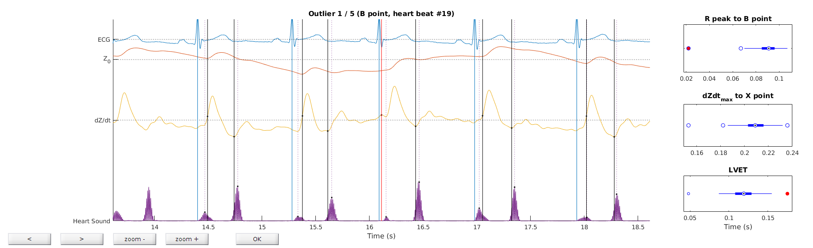
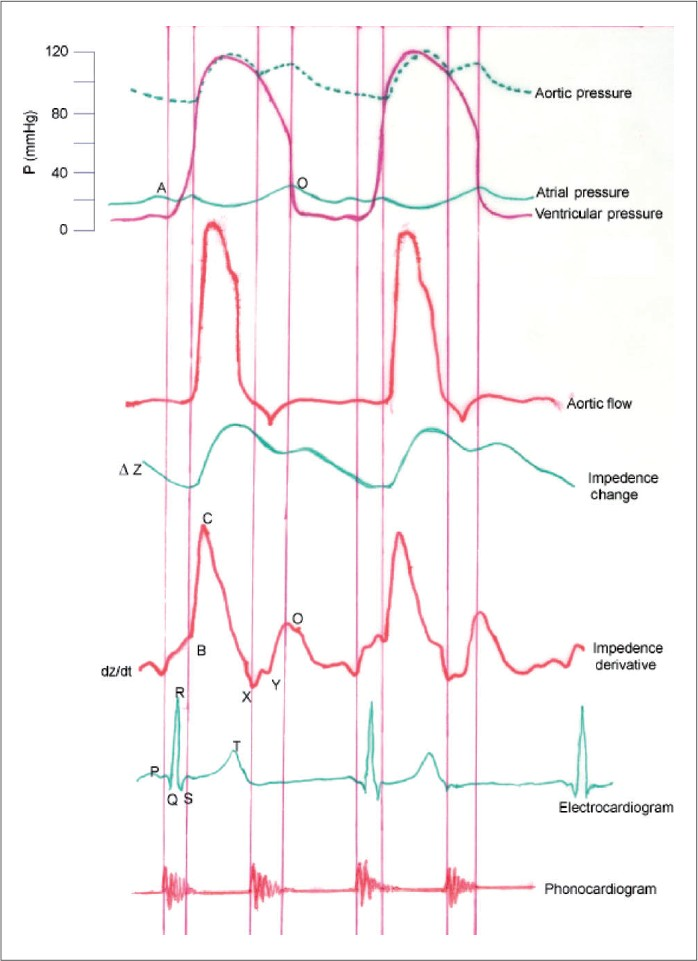

# Using heart functions

To setup, include the path to the two functions in the MATLAB path. This tool requires FieldTrip (http://www.fieldtriptoolbox.org/)

## Using heart_peak_detect.m

This function reads an electrocardiogram (ECG) data channel and finds R peaks (and others). It returns a structure with fields R_sample and R_time, sample and time points of each heart beat. Other components of the ECG are returned as well following the same scheme.

Data can be read using FieldTrip’s ft_preprocessing function

    cfg                              = [];
    cfg.dataset                 = 'MERGE_CUT_pilote1_damier_EBI_12_5_kHz_tsss.fif';
    cfg.channel                 = {'EBI_-_Magnitude' 'ECG1' 'HeartSound'};
    data_raw                    = ft_preprocessing(cfg);

Detecting heart peaks can be done as follows. All that is needed is an ECG channel (here ‘ECG1’).

    cfg = [];
    cfg.channel = 'ECG1';
     
    [HeartBeats] = heart_peak_detect(cfg,data_raw);

The function can also be called with simpler (legacy, not recommended) method:

    ECG = data_raw.trial{1}(2,:);
    fs = data.fsample;

    [HeartBeats] = heart_peak_detect(ECG,fs);

The algorithm of the function is as follows:
The signal is first high and low pass filtered (default 1-100 Hz). The square of the z-scored ECG is computed and a first detection is performed as the peaks passing the cfg.thresh (default 10). Not all R peaks need to be selected at this step. Just enough to create a template heart beat ECG (HB) is necessary. If cfg.plotthresh is true, then a figure is shown, allowing the user to edit the threshold. Then a template HB is computed (shown in a figure if cfg.plotbeat) and convolved with the whole ECG time series. The resulting convolution is normalized to have a maximum of 1 and beats are taken as peaks above cfg.corthresh (cfg.corthresh). 
In both steps, a minimum distance between beats of cfg.mindist is enforced.
Other peaks are found based on each R peak. Q is the minimum within 50 ms before R, S is the minimum within 100 ms after R, and T is the maximum between the S peak and a maximum QT interval of 420 ms (a rough standard...).
If cfg.plotcorr is true, then a figure with all heart beats is shown. The user is asked whether or not they want to change the threshold of the correlation. In last resort, outlier heart beats (based on interbeat interval) can be remodeled. 

## Using heart_SV_calc.m

Stroke volume (SV) can be estimated non invasively based on impedance cardiography (Kubiceck et al. 1970, Allen et al. 1990). In brief, changes in impedance around each heart beat are detected and a formula is applied to retrieve SV (Berntson et al. Handbook).

_Note_: Obtaining a reliable absolute estimate of SV from impedance cardiography is difficult, and several important parameters are to be tuned. Obtaining a reliable relative estimate is easy using this function. In other words, relative changes in SV across heart beats within one recording in one subject are reliable. The absolute volume (in mL) is provided as indication and does not correspond to a reliable estimate. This function should by no means be used directly for clinical diagnostic.

    cfg = [];
    cfg.interactive = 'no';
    cfg.L = L;
     
    [HeartBeats] = heart_SV_calc(cfg,data_raw);

Retrieve SV with

	[HeartBeats.SV]

Use feedback to remove outliers
 
    cfg = [];
    cfg.L = L;
     
    [HeartBeats] = heart_SV_calc(cfg,data_raw);

The feedback window that opens exploits the expected regularity of the cardiac cycle to detect potential mislocalizations of the time points used to determine SV.

A figure thus opens, with the time course of the ECG, impedance (Z0), its temporal derivative (dZ/dt) and heart sounds (if available). The times of opening and closing of the aortic valve (often referred to as the B and X point, respectively) are estimated on the dZ/dt trace at each cycle (black vertical lines). The time between X and B is called left ventricular ejection time (LVET).

The distributions of R peak to B point, dZdt_max to X point, and LVET are computed and outliers to these distributions are inspected (red vertical line). The user may click on the trace to move the estimated time of a given outlier.

The figure below shows how the B and X points should be located wrt impedance changes. Note that the B point can be mapped to the end of the first sound of the cardiac cycle (S1), whereas the X point can be mapped to the beginning of the second sound (S2).

See also [Using_heart_functions.m](Using_heart_functions.m)

[Heart Functions](https://github.com/dnacombo/heart_functions) by Maximilien Chaumon is licensed under [CC BY-NC-SA 4.0](https://creativecommons.org/licenses/by-nc-sa/4.0/?ref=chooser-v1)